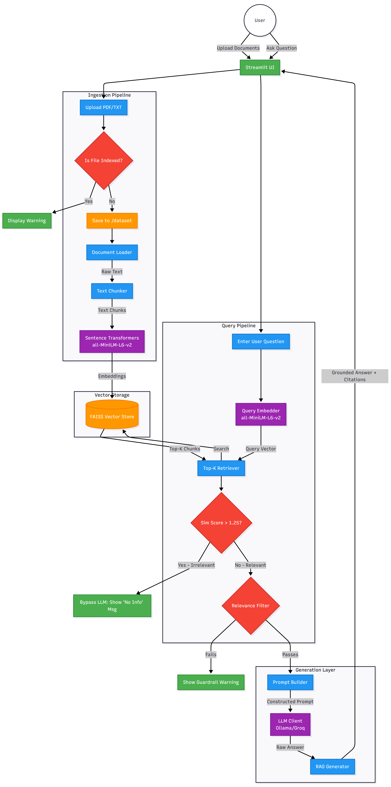

# AI-Powered Document Search & Chat (RAG)

**🔗 [Live Demo Available on Hugging Face Spaces](https://huggingface.co/spaces/rajivrane203/ai-docs-search-rag)**

A production-grade, local Retrieval-Augmented Generation (RAG) system for querying PDF and TXT documents. Built with Ollama, FAISS, and Sentence-Transformers.

This project provides a modern Streamlit web application to easily extract grounded answers from your document collections, featuring hybrid cloud/local deployment options, strict hallucination guardrails, and real-time ingestion deduplication.

## Project Goals & Architecture

The primary objective of this project is to build an intelligent document parsing and Q&A system that:
- **Ensures Data Privacy:** Capable of running fully locally on CPU-optimized hardware.
- **Prevents Hallucinations:** Utilizes strict prompting, rigid relevance thresholds, and retrieval-based guardrails to answer based exclusively on the provided context.
- **Provides Explicit Citations:** Every answer pinpoints the exact document filename and page number where the information was sourced.
- **Demonstrates Clean Architecture:** Built with modular components (Ingestion, Retrieval, Generation, Guardrails) for maintainability and scalability.

### System Architecture Diagram



## Data Flow & Features

1. **Ingestion & Deduplication**: Users upload documents via the Streamlit UI. The system runs a structural deduplication check against the dataset directory to prevent duplicate indexing and wasted compute. 
2. **Chunking**: Raw text is parsed (using PyMuPDF for PDFs) and split into 800-token chunks with a 150-token overlap to maintain context boundaries.
3. **Embedding**: Chunks are vectorized using the highly efficient `all-MiniLM-L6-v2` model.
4. **Storage**: Vectors and metadata are stored persistently in a local FAISS index.
5. **Retrieval**: User queries are embedded and matched against the FAISS index using L2 distance scoring.
6. **Validation & Guardrails**: The system applies a hard cutoff similarity threshold (L2 distance > 1.25). If retrieved chunks are completely irrelevant, the LLM is bypassed entirely to save resources. A secondary relevance filter computes confidence scores.
7. **Generation**: Relevant chunks are formatted into a rigid prompt. The system uses an OpenAI-compatible client, supporting both local execution (Ollama with `phi3:mini`) and cloud execution (Groq with `llama-3.3-70b-versatile`).

## Setup & Installation

### 1. Prerequisites
You can run the system locally using Ollama or via cloud using Groq.
- For local execution, install [Ollama](https://ollama.com/) and pull the required model:
   ```bash
   ollama pull phi3:mini
   ```

### 2. Clone & Install Dependencies
1. Clone this repository and navigate to the project root:
   ```bash
   git clone https://github.com/rajiv-rane/ask-your-docs.git
   cd ask-your-docs
   ```
2. Create and activate a virtual environment (recommended):
   ```bash
   python -m venv venv
   # Windows:
   venv\Scripts\activate
   # Linux/Mac:
   source venv/bin/activate
   ```
3. Install the required Python packages:
   ```bash
   pip install -r requirements.txt
   ```

### 3. Docker Deployment (Optional)
To run the containerized version of this application locally:
```bash
docker build -t ai-docs-search-rag .
docker run -p 7860:7860 ai-docs-search-rag
```

### 4. Configuration (Optional)
The system defaults to Local Mode. To use Cloud Mode for faster generation, set the following environment variables before starting the application:
```powershell
# Windows
$env:DEPLOYMENT_MODE="cloud"
$env:GROQ_API_KEY="your-groq-api-key"
```

## Usage

Start the interactive web application:
```bash
streamlit run ui/app.py
```

### Working with the Dataset
Upload your own `.pdf` or `.txt` files directly through the Streamlit sidebar. The system will automatically chunk, embed, and index them in real-time.

A comprehensive sample dataset containing CUAD contracts, SEC filings, and various legal agreements is available here:
[Dataset Google Drive Link](https://drive.google.com/drive/folders/1V_JAWu9wEn1aWxrgFi3wXdyKDFNDCYlF?usp=sharing)

You can download these files and upload them via the web interface to test the system's capabilities.

## Technical Decisions & Trade-offs

- **FAISS vs. Managed Vector DBs**: Chose FAISS over Pinecone/Weaviate for high-performance, local persistence without external dependencies. Trade-off: Lacks built-in hybrid search without manual implementation.
- **all-MiniLM-L6-v2**: Selected for optimal balance of speed on CPU and semantic accuracy. Trade-off: Smaller dimension (384) might miss deeply nuanced relationships compared to OpenAI embeddings, but guarantees fast local execution.
- **Hybrid LLM Architecture (phi3:mini / Llama-3.3-70b)**: Designed an interface to hot-swap between a strict local execution (`phi3:mini` via Ollama) for privacy, and a cloud execution (`Llama-3.3` via Groq) for high-speed inference on restricted hardware like free-tier Docker containers.
- **Rigid Guardrails & Hard Cutoffs**: Implemented a hard L2-distance cutoff (`1.25`) before querying the LLM. Trade-off: Might occasionally reject moderately relevant chunks, but strictly guarantees no context-free hallucinations and saves API tokens/compute.
- **Chunk Size (800 / 150 overlap)**: Carefully balanced to provide enough context for complex legal queries (CUAD datasets) while fitting within the limited context windows of smaller local models.

## Limitations

- **Scaling**: Extremely large datasets (10k+ pages) may encounter index build time overhead on low-power CPUs during the vectorization phase.
- **Local Dependencies**: Local mode requires the Ollama service running in the background.

## Future Improvements

- **Hybrid Search**: Combining semantic search with BM25 keyword matching for better technical term retrieval.
- **Multi-Query Expansion**: Using the LLM to generate variations of user queries to overcome vocabulary mismatches.
- **Table Support**: Enhanced parsing for complex tables in structured PDFs.
